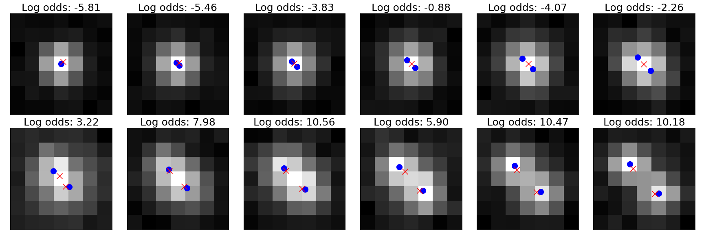
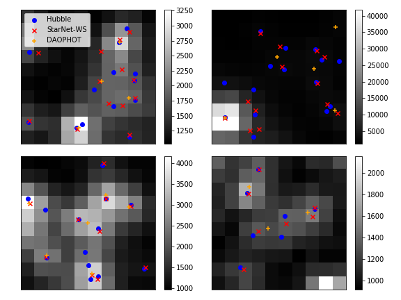

# Variational Inference for Deblending Crowded Starfields

This Github repository implements *StarNet*, a probabilistic deblender employing variational Bayesian inference and deep learning. 
The scripts here reproduce the results found in 

Runjing Liu, Jon D. McAuliffe, and Jeffrey Regier. 
Variational Inference for Deblending Crowded Starfields. 
https://arxiv.org/pdf/2102.02409.pdf

Ongoing developments can be found in the [BLISS](https://github.com/applied-bayes/bliss/tree/master/bliss) (Bayesian LIght Source Separation) repository. 
Developments include 

- Implementation of neural network training in [Pytorch Lighting](https://pytorch-lightning.readthedocs.io/en/stable/) for lightweight, optimized code. 
- Automatic hyper-parameter tuning in [Optuna](https://optuna.org/). 
- Extensions to galaxy models. 

## Installation

This code relies on Pytorch. 
Pytorch installation details may vary depending on whether CUDA is available on your machine. 
Installation details can be found [here](https://pytorch.org/). 

Our results were created under Pytorch version 1.4. 
When CUDA is available, installation with conda can be done by typing

```
conda install pytorch==1.4.0 torchvision==0.5.0 -c pytorch
```

Then, to install the local library `deblending_runjingdev` and its other dependencies, run 

```
pip install ./
```

To download the SDSS image of M2, type 

```
# move to the sdss data directory
cd sdss_stage_dir

# download data
./get_sdss_data.sh
```
And to dowload the Hubble catalog of M2, type 

```
# move to the hubbe data directory 
cd experiments_m2/hubble_data/

# download hubble data
wget https://archive.stsci.edu/pub/hlsp/acsggct/ngc7089/hlsp_acsggct_hst_acs-wfc_ngc7089_r.rdviq.cal.adj.zpt
```

## Deblending example

For a simple example of sleep phase training, see the `./experiments_deblending/` directory. 
In that directory, run 

> `python train_encoder.py`

which will fit a variational distribution on sleep-phase simulated data. 
The simulated data are 7 x 7 tiles with either one or two stars. 
See `./experiments_deblending/deblending_experiment.ipynb` to load the fitted variational distribution. 
Sample results, after 30 epochs of training: 



Blue are true locations, red are estimated locations. Log-odds are log(Prob(#stars = 2)) - log(Prob(#nstars = 1)) under the fitted variational distribution. 

## Results on M2
In the `./experiments_m2/` directory, run

```
./train_wake_sleep.sh
```

to fit StarNet on the subimage of M2 described in the paper. 
After fitting, the key results in our paper can be loaded in `./experiments_m2/jupyter/m2_results.ipynb`. 
Example subimages from M2: 



where blue are detetions from the Hubble catalog (used as our ground truth) and red are detections by StarNet. 
Orange are detections from a catalog reported by [An et al.](https://arxiv.org/abs/0808.0001), who used 
a competing method called DAOPHOT. 
